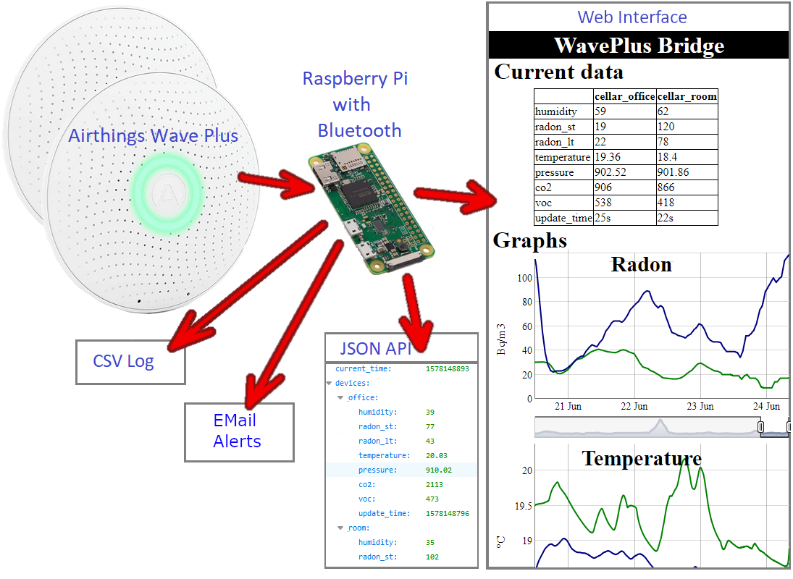

# Airthings **Wave Plus Bridge** to Wifi/LAN

This tool provides a bridge between one or multiple **Airthings Wave Plus** sensors and the **Wifi/LAN** network, using a **Raspberry Pi** that supports Bluetooth Low Energy (BLE). In detail, the bridge provides the following features:
 
* Wave Plus sensor monitoring
  - Scanning of one or multiple Wave Plus devices in a user definable interval
* HTTP web server
  - Presentation of the Wave Plus sensor data as HTML web page
  - Exposure of the sensor data via a JSON API
* Email alerts
  - High flexibility in specifying alert conditions
* Logging of the sensor data in a CSV file

The tool runs with Python 3.x. It can be installed as a service that is launched automatically when the Raspberry Pi boots.



## Table of contents

* [Requirements](#requirements)
    * [Hardware Requirements](#hardware-requirements)
    * [Software Requirements](#software-requirements)
* [Wave Plus Bridge Configuration](#wave-plus-bridge-configuration)
    * [Command Line Configuration](#command-line-configuration)
    * [YAML based Configuration](#yaml-based-configuration)
* [Wave Plus Bridge Installation](#wave-plus-bridge-installation)
    * [Wave Plus Bridge Installation](#wave-plus-bridge-installation)
    * [Setup the Wave Plus Bridge as a Service](#setup-the-wave-plus-bridge-as-a-service)
* [Raspberry Pi Installation](#raspberry-pi-installation)
    * [Raspbian installation](#raspbian-installation)
    * [Python Library Installation](#python-library-installation)
* [Related topics](#related-topics)

# Requirements

## Hardware Requirements

The following hardware components are required to run the Wave Plus Bridge:

* One or multiple Airthings Wave Plus devices
* A Raspberry PI that supports Bluetooth Low Energy (BLE) (by providing either built-in support or via a Bluetooth adapter)

It should be ensured that the Wave Plus devices run the latest firmware. To do so, they should have been connected once to the official Airthings IPhone/Android application.

The tool has been tested on a Raspberry Pi Zero W and on a Raspberry Pi 4, both running on Raspbian Buster. Two Wave Plus devices have been simultaneously accessed.


## Software Requirements

The following software packages need to be installed on the Raspberry Pi:

* Python 3
* The Python 3 library BluePy
* The Python 3 library yaml (PyYAML)

The tool has been tested with Python 3.7.2 and BluePy 1.3.0.

The sections [Raspbian installation](#raspbian-installation) and [Python Library Installation](#python-library-installation) provide support for the installation of the Raspbian OS and the Python library installation.


# Wave Plus Bridge Configuration

The Wave Plus Bridge can be configured via command line arguments, via a YAML configuration file or via a combination of both of them. The command line arguments have precedence over the YAML configuration file, which has been used in an example below to override the log file definition. Advanced configurations, e.g. email alerts, can only be performed via the YAML file and not via command line arguments.


## Command Line Configuration

Running the Wave Plus Bridge Python program with the *-h* argument will provide comprehensive instructions about the tool configurations:

```
sudo /opt/waveplus_bridge/waveplus_bridge.py -h
```

```
usage: waveplus_bridge.py [-h] [--period PERIOD]
                          [--data_retention DATA_RETENTION] [--port PORT]
                          [--csv CSV] [--log LOG] [--config CONFIG]
                          [--emulation] [--report_performance]
                          [sn [sn ...]]

Wave Plus to Wifi/LAN Bridge

Positional arguments:
  sn                    10-digit serial number of a Wave Plus device (see
                        under the magnetic backplate. This number can be
                        combined with a device nickname, separated by a column
                        from the serial number ("2931234567, my_office")

Optional arguments:
  -h, --help            Show this help message and exit
  --period PERIOD       Time in seconds between reading the sensor values
  --data_retention DATA_RETENTION
                        Data retention time in seconds
  --port PORT           Port of the HTTP web server
  --csv CSV             CSV file to store data
  --log LOG             Log file. If not specified the stdout is used
  --config CONFIG       YAML configuration file
```


## YAML based Configuration

The same and additional parameters can also be configured via YAML files specified with the --config command line argument. The Wave Plus Bridge package provides a YAML template file (waveplus_bridge.yaml) that has to be adapted to the specific needs.


### Basic Configuration

The basic configuration includes the specification of the Wave Plus devices serial numbers, the sensor update period, the HTTP port and optionally the log file.

```
# Update period: Time in seconds between reading the sensor values
period: 120

# SN: List of 10-digit serial number of one or multiple Wave Plus devices (see 
# under the magnetic backplate. Each number can be combined with a device 
# nickname, separated by a column from the serial number 
# (e.g. "2931234567, my_office").
sn:
   - 2931234567, my_office
   - 2931234569, my_living

# HTTP/Web server port: If no HTTP/web server is required, comment the 
# following line.
port: 80

# Log file: Comment the following line to log all information to stdout.
log: /var/log/waveplus_bridge.log
```

### CSV Database and Graph Generation

The CSV database is used to generate data graphs on the HTML page and to allow processing the data in external tools. The CSV file is reloaded after a restart, which guarantees that the generated graphs shows also the previously recorded data.

```
# CSV log file: If no CSV data logging is required, comment the following line.
csv: /var/log/waveplus_bridge.csv

# Data retention time in seconds (to limit the memory use)
data_retention: 2678400 # 31 days

# The graph decimation allows reducing the CSV data used to generate the graphs 
# (see logdb.get_csv)
graph_decimations:
   -1.0: 8  # -31 days (full range)
   -5760: 3 # - 8 days
   -750: 1  # - 25 hours
```

### EMail Alerts

Email alerts can be sent when certain conditions are met (e.g. radon level higher than 100 Bq/m3 for more than 1 hour). To send such email alerts, an SMTP server has to be specified and one or multiple alert triggers defined.

The following lines show an example of a SMTP server configuration:

```
smtp_server:
    # Mail server address
    server: mail.server.com

    # Mail server port, e.g. 25, 465, 587
    port: 465
    
    # Options: SSL, TLS, or no definition (default)
    security: SSL
    
    # Login user name
    user: wave@plus.com
    
    # Login user password
    password: bridge123
```

One or multiple alerts can be defined. Each alert has one or multiple sources (device sensors), a trigger and one or multiple actions.

The first example of an email alert configuration uses the simplest form (single source, single threshold level, single mail destination address). Comprehensive explanations about the parameters are given in the 2nd example. The alert configuration is added in form of a list (starting with "-") to allow adding additional configurations:

```
alerts:
    -   sources:
            my_office:radon_st
        trigger:
            above: 150
            for: "00:30:00"
            min_interval: "01:00:00"
        actions:
            mail:
                from: wave.plus@myhome.com
                to: sophia.millar@family.com
```

The second alert configuration uses multiple sources, trigger levels and mail destination addresses. It provides all necessary information to understand the configuration options:

```
# Remove the following line (alerts:) if this example should be concatenated to
# the previous one.
alerts:
    -   # At least one source (device:sensors) has to be defined as trigger
        # source. The example shows the definition of multiple sources 
        # (list form):
        sources:
            - my_office:radon_st
            - my_living:radon_st

        # Various parameters allow defining the exact conditions when 
        # triggering should occur:
        trigger:
            # A triggering happens if a sensor value is above or below a 
            # certain level. In this sense, the condition can be specified 
            # with the keywords 'above' or 'bellow' and a single threshold
            # level, or as the example shows, as a list of threshold levels.
            above: [100, 200, 400, 1000]

            # 'For' delays the trigger until the specified condition is valid
            # for a time span specified either in seconds, or in the format
            # Hours:Minutes:Seconds. The trigger delay is applied individually
            # for each specified trigger threshold level:
            for: "00:30:00"

            # 'min_interval' allows specifying a minimum re-triggering 
            # interval. The provided value is specified either in seconds, or 
            # in the format Hours:Minutes:Seconds. The minimum re-triggering
            # interval is not respected if the re-triggering is due to a
            # higher trigger threshold level than the previously triggering.
            min_interval: "01:00:00"

        # One or multiple actions can be specified. An action can be a mail 
        # alert, or a message to the stdout and to the log file.
        # Both mail and print alerts allow customizing the alert information 
        # with the keyword 'message'. The specified message may contain the
        # following placeholders: %v: sensor value, %d: device, %s: device 
        # sensor.
        # The example below shows the definition of a mail alert and a print 
        # alert (list starting with "-"):
        actions:
            -   mail:
                    # Author mail address
                    from: wave.plus@myhome.com

                    # Single or multiple destination addresses. Multiple 
                    # addresses as shown in the example are provided in form 
                    # of a list
                    to:
                        - liam.smith@family.com
                        - olivia.brown@family.com

                    # Mail subject
                    subject: 'Radon alert'

                    # Mail message, see above
                    message: |-
                        Radon level is too high!
                        Sensor: %d, %s
                        Level: %v'
            -   print:
                    # Print message, see above
                    message: |-
                        Radon level is too high!
                        Sensor: %d, %s
                        Level: %v'
```


# Wave Plus Bridge Installation


## Wave Plus Bridge Installation

The following commands install the Wave Plus Bridge in the directory /opt/waveplus_bridge.

Download and unzip the Wave Plus Bridge software from GitHub:

```
wget https://github.com/Drolla/WavePlus_Bridge/archive/master.zip
unzip master.zip
```

Copy it to /opt/waveplus_bridge, and make the Main Python script executable:

```
sudo mv WavePlus_Bridge-master /opt/waveplus_bridge
sudo chmod 775 /opt/waveplus_bridge/waveplus_bridge.py
```

Adapt the configuration, see [Wave Plus Bridge Configuration](#wave-plus-bridge-configuration):

```
sudo nano /opt/waveplus_bridge/waveplus_bridge.yaml
```

The Wave Plus Bridge is now ready to be started. To get the log information displayed directly on the terminal for debugging purposes, override the log file definition (--log argument):

```
sudo /opt/waveplus_bridge/waveplus_bridge.py \
       --config /opt/waveplus_bridge/waveplus_bridge.yaml \
       --log ""
```

The log output will confirm if the bridge could successfully connect to the Wave Plus devices:

```
Read configuration file /opt/waveplus_bridge/waveplus_bridge.yaml
Configuration: 
   {'period': 120, 'sn': ['2930012345', '2931234569'], 'port': 80, 
    'csv': '/var/log/waveplus_bridge.csv', 'log': '', 
    'config': '/opt/waveplus_bridge/waveplus_bridge.yaml', 
    'name': {'2931234567': 'my_office', '2931234569': 'my_living'}}
 Data are logged to CSV file /var/log/waveplus_bridge.csv
 HTTP/Web server started on port 80
 Press ctrl+C to exit program!
 Device 2931234567 found, MAC address=a4:da:32:b9:53:c2
 Device 2931234569 found, MAC address=a4:da:32:b9:3f:b6
```

If the bridge has been successfully started, check if a connection to the HTTP/Web server can be established from a web browser (use address: http://<RaspberryPI_IP_Address>:<Port>).

Omit simply the --log argument to use the log file specified by the YAML configuration file.


## Setup the Wave Plus Bridge as a Service

Add the start/stop program provided by the Wave Plus Bridge package to the init.d directory and make it executable:

```
cd /etc/init.d/
sudo cp /opt/waveplus_bridge/init.d/waveplus_bridge .
sudo chmod 755 ./waveplus_bridge
```

Modify this start/stop program if necessary, for example to select a different YAML configuration file.

```
sudo nano ./waveplus_bridge
```

Add then the service to the system:

```
sudo update-rc.d waveplus_bridge defaults
```

Check if the start/stop script can be executed correctly :

```
sudo ./waveplus_bridge
-> Usage: /etc/init.d/waveplus_bridge {start|stop|restart|status}
```

```
 sudo ./waveplus_bridge start
-> [ ok ] Starting waveplus_bridge (via systemctl): waveplus_bridge.service.
```

```
 sudo ./waveplus_bridge stop
-> [ ok ] Stopping waveplus_bridge (via systemctl): waveplus_bridge.service.
```

Check if the service starts automatically after a reboot:

```
sudo reboot
```

If necessary, the service can be disabled:

```
sudo update-rc.d waveplus_bridge disable
```


## Raspberry Pi Installation

## Raspbian installation

The installation procedure is explained on this page: <https://www.raspberrypi.org/documentation/installation/installing-images/README.md>

Download latest Raspbian operating system from <https://www.raspberrypi.org/downloads/raspbian/>
Tested release 2019-09-26, full and lite versions.

Unzip the compressed image (e.g. with 7-Zip on Windows. Download: <https://www.7-zip.org/>)

Flash the image to a SD card, for example by using the Belena Etcher tool that is available on Windows, Linux and macOS. It can be downloaded here: <https://www.balena.io/etcher/> (version 1.5.57 has been tested on Windows).

The first connection can either happen by connecting monitor, keyboard and mouse to the Raspberry Pi, or connecting it via a cable to the network and accessing it via SSH. For this second option the SSH service can be enabled by adding an empty file called *ssh* to the boot sector of the SD card. This boot sector is accessible also on Windows (the SD card may need to be unplugged an plugged again to get it mounted).

Put the SD card into the Raspberry Pi and connect optionally monitor, keyboard and mouse to it.

Power up the Raspberry Pi.

If the connection is happening via SSH, search for the Raspberry using a network scanner (on Windows you can select one on: <https://www.pcwdld.com/best-free-ip-scanners-port-service-scannin>). Once the IP address has been identified, an SSH connection can be made via an SSH client (e.g. Kitty on Windows, download: <http://kitty.9bis.net/>.

Update system by running:

```
sudo apt update
sudo apt dist-upgrade
```

Setup optionally the network configuration (e.g. Wifi) and change the default password by running the system configuration tool:

```
sudo raspi-config
```

Ensure that the Bluetooth interface is enabled: 

```
sudo bluetoothctl
[bluetooth]# power on
[bluetooth]# exit
```


## Python Library Installation

The Raspbian Buster lite and full versions include both Python 3.7.3. However pip3, the Python Package Installer that is required to install additional packages is not pre-installed on the lite version. The following command will install it:

```
sudo apt install python3-pip
```
 
Install the Python3 packages that are missing to run the Wave Plus Bridge:

```
sudo pip3 install PyYAML
sudo pip3 install bluepy
```

# Related topics #

* [Correlation between Airthings Wave Plus and Corentium Plus Devices](https://github.com/Drolla/WavePlus_Bridge/wiki/Radon-Measurement-Correlation)
